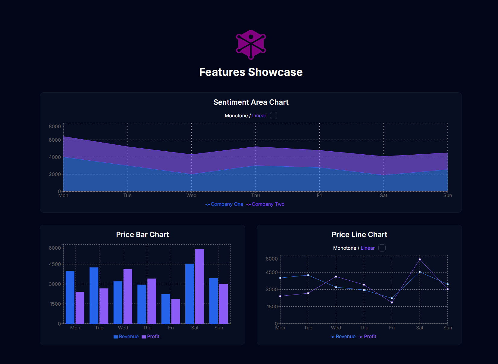

# AI Investor Features Showcase

This is a small demo application showcasing how charts and visualizations could look within the **AI Investor** app. It demonstrates various chart types and simple animations to give an impression of the UI/UX possibilities.

## Live Demo

Check out the live version here: [https://features-showcase-001.netlify.app/](https://features-showcase-001.netlify.app/)

## Screenshot

  
_Example view of charts and animations in the app_

## Features

-   Visualizes different types of charts (area, bar, line) using [Recharts](https://recharts.org/)
-   Smooth animations implemented with [GSAP](https://greensock.com/gsap/)
-   Built with [Next.js](https://nextjs.org/) and React
-   Styled with Tailwind CSS and DaisyUI

## Tech Stack

-   **Next.js** — React framework for server-side rendering and routing
-   **React** — UI library
-   **Recharts** — Charting library for React
-   **GSAP** — Animation library used for smooth element transitions
-   **Tailwind CSS & DaisyUI** — Utility-first CSS framework and component library

## Getting Started

Install dependencies:

```bash
npm install
```

Run the development server:

```bash
npm run dev
```

Build for production:

```bash
npm run build
```
